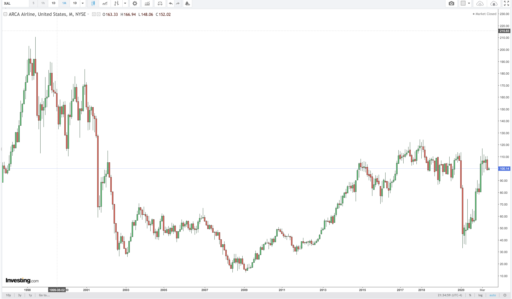

# **Investigation on Valuation of  US Airline Industry in midst of Pandemic**

---
## **Background**
The airline industry was devastated by the Covid 19 pandemic. According to the Mckinsey Report, airline sector sales in 2020 was  about 40% of previous year, and in nominal terms same as in 2000. It has been projected that air traffic won’t return to 2019 levels before 2024.

There has been a substantial drop in demand for air travel as a result of travel restrictions and lockdowns. As a result of the decrease in passenger traffic, flights have been cancelled or planes have flown at reduced capacity. Airlines are required to issue refunds for cancelled flights under US Department of Transportation regulations, where as Airlines in other countries have refunded through travel vouchers.

On the other side, as passenger planes have been cancelled, the cost of shipping cargo has skyrocked. According to NY times article, cost of sending cargo across the Pacific Ocean tripled by late March 2020.  At the end of March 2020, cargo capacity was down by 35% compared to the previous year.

//Bailout

//Virus spread and variants

(Source: Investing.com)

The initial reaction of stock market to pandemic was drastic correction in prices of airline stocks.  By the end of 2021, the prices of airline stock has recovered to pre-pandemic levels.

---
## **Objective**
To investigate the stock prices of airlines industry and comment on the valuation of the industry

---
## **Collaborators**
* [Ethol Palmer](https://github.com/etholpalmer)
* [Ashweej Shenoy](https://github.com/ashweej18)
* [John Mari Manghas](https://github.com/adobopeanuts)
* [Monique Rowe](https://github.com/moniquerowe15)

---
## **Steps**

---
## **Technologies/Tools/Libraries**
1. Python
2. Pandas
3. Matplotlib
4. Panel
5. Holoviz
6. Plotly
7. Pyviz
8. Alapaca Market API
9. SIMFIN API
10. Jupyter Notebook

---
## **Data**

---
## **Code**

---
## **Output**

---
## **Conclusion**

---
## **References**
* [Mckinsey Report on Airline Industry](https://www.mckinsey.com/industries/travel-logistics-and-infrastructure/our-insights/back-to-the-future-airline-sector-poised-for-change-post-covid-19)
* https://www.nytimes.com/2020/03/23/business/coronavirus-china-masks.html

Monique

Ashweej

Ethol

John
